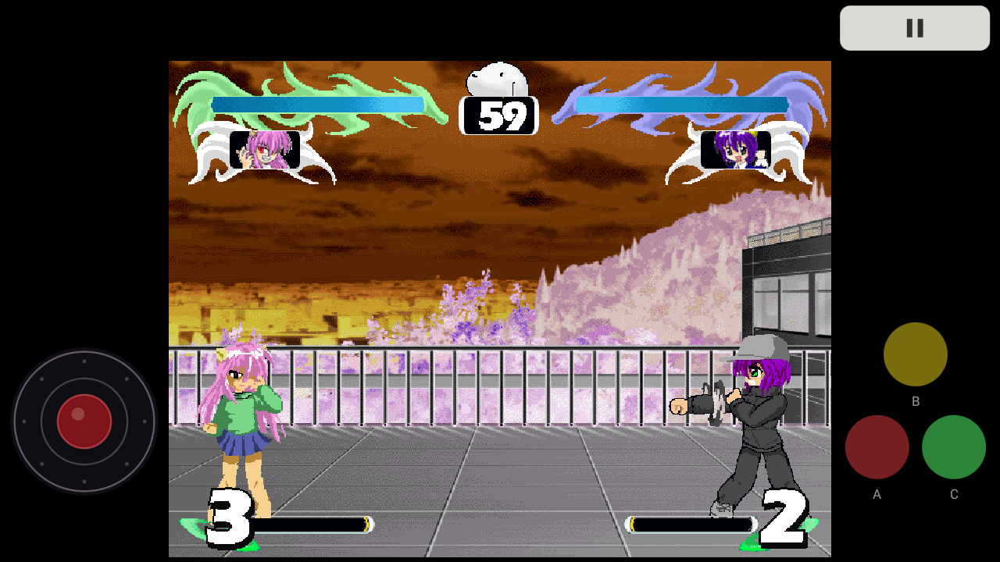
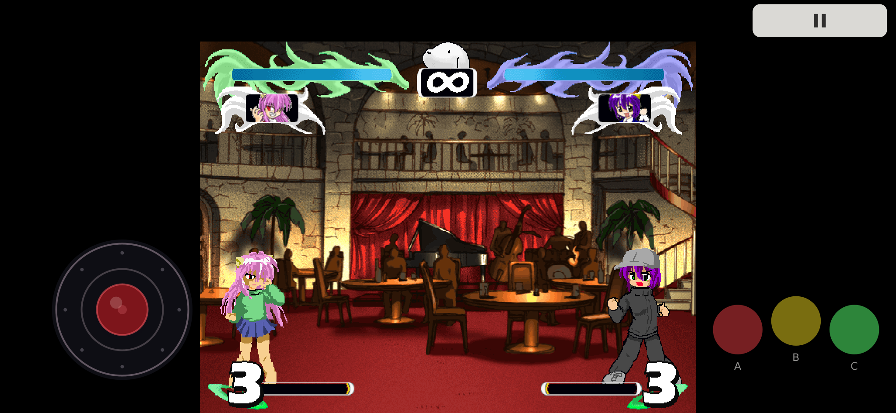

# [⬇ Скачать APK v1.0.0-rc1](https://github.com/yugenmagan/elfen-lied-fighting-android/releases/download/v1.0.0-rc1/elfen-fighting-v1.0.0-rc1.apk)

**Android 10+ · Автономная игра · English / 日本語 / Русский**

# Elfen Lied Fighting — неофициальный Android-порт

Старая фанатская игра **Elfen Lied Fighting** теперь работает на Android.

Это не ремейк и не новая игра по Elfen Lied: порт использует оригинальных персонажей, арены, музыку, сюжетные сцены и игровые данные.

Автор оригинальной фанатской игры — **ねくぱっち**.

[English](README.md)

## Скачать и играть

1. [Скачай APK](https://github.com/yugenmagan/elfen-lied-fighting-android/releases/download/v1.0.0-rc1/elfen-fighting-v1.0.0-rc1.apk).
2. Если Android попросит разрешение на установку приложений из браузера или файлового менеджера — разреши его.
3. Установи игру и запускай.

## Что есть в этой версии

- Сюжетный режим и Versus.
- Оригинальные персонажи, арены, музыка, звуки и сюжетные сцены.
- Сенсорное управление с одновременными нажатиями.
- Японский, английский и русский текст.
- Оригинальные шкалы здоровья, таймер и портреты персонажей.
- Экспериментальная поддержка геймпадов.
- Пауза и Continue для текущей игровой сессии.
- Необходим **Android 10** или новее.

## Управление

Сенсорное управление поддерживает multitouch. Размер и положение элементов можно изменить в настройках. Белая кнопка открывает паузу.

## Изображения

Предпросмотр расположения управления:

## Авторы и права

**Оригинальная фанатская игра:** ねくぱっち

**Elfen Lied / エルフェンリート:** Линн Окамото / 岡本倫. Манга издавалась Shueisha / 集英社.

**Android-порт:** yugenmagan

Это неофициальный некоммерческий фанатский проект. Порт не претендует на авторство оригинальной игры, персонажей, графики, музыки и других исходных материалов.

Подробные сведения об авторах и происхождении материалов находятся в [CREDITS.md](CREDITS.md).

## Известные ограничения

Это **RC1**, поэтому багрепорты и отзывы очень приветствуются.

В некоторых редких ситуациях поведение может немного отличаться от оригинальной Windows-версии. Поддержка геймпадов, звук, вибрация и задержка управления также могут различаться на разных устройствах.

Подробности — [KNOWN_ISSUES.md](KNOWN_ISSUES.md).

Документация разработки

[Сборка](BUILDING.md) · [Журнал переноса](PORTING_NOTES.md) · [Форматы](FORMAT_NOTES.md) · [Результаты тестов](TEST_RESULTS_RC1A.md) · [Изменения](CHANGELOG.md)

